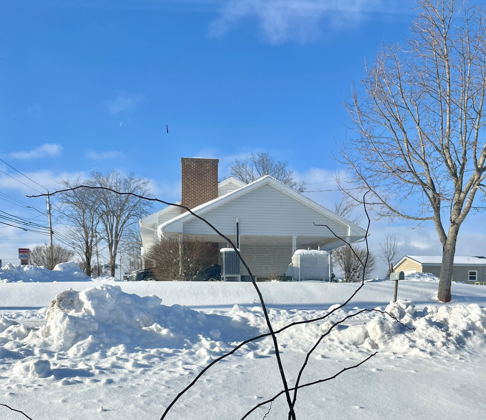
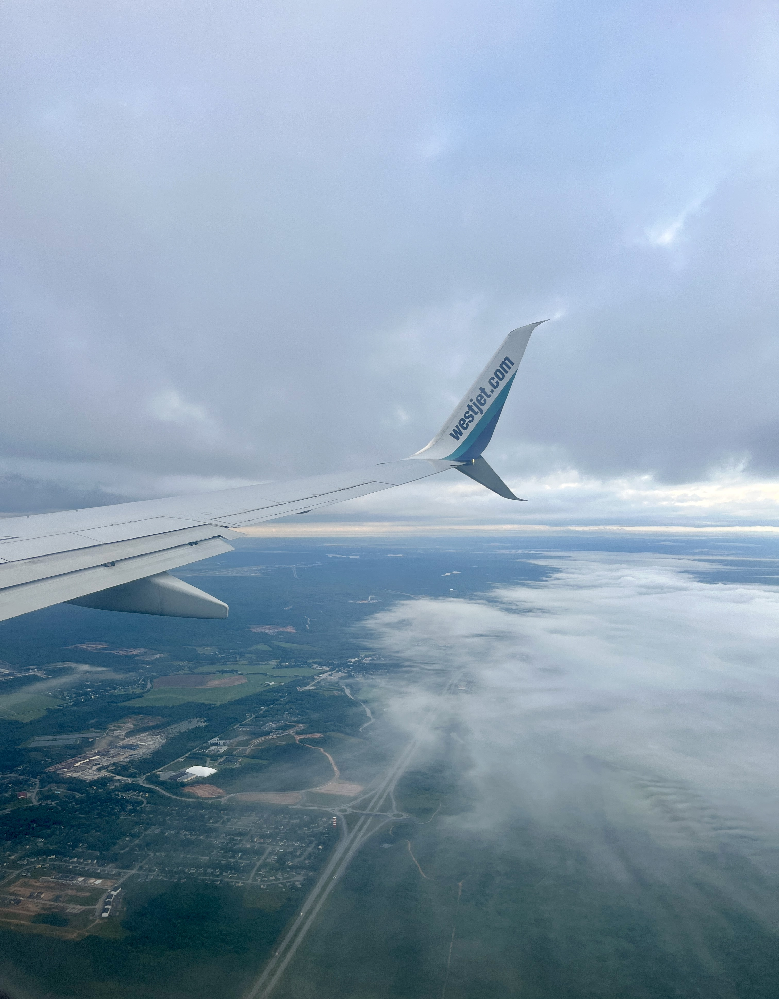
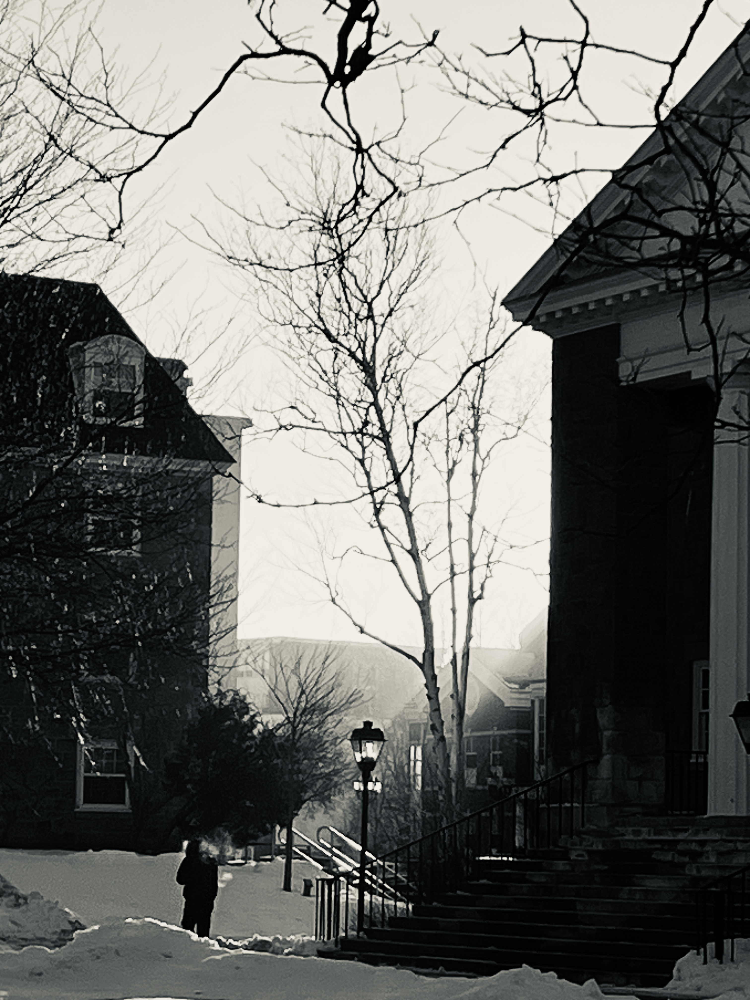

# 去国不怀乡
#### 一、入境

在加拿大生活已近半年，枫叶变红又变黄，秋雨来去，落叶无痕，此时窗外飘着纷纷无际的大雪。

我所在的新斯科舍省，属于加拿大海洋四省之一，第二温暖的省份，几乎是距离中国最远的地区，东临大西洋，似一座狭长岛屿，海洋环抱，北部一百多公里是北美著名的布雷顿角。全省人口一百万左右，省会哈利法克斯独占五十。新斯科舍，英文为: Nova Scotia，源自拉丁语“新苏格兰”之意，暗示了最早的殖民者是18世纪的苏格兰王国，本地原住民族群为米克马克。

来此之前我在这个国家没有一个认识的人，这也是我第一次出国，跟家人说有同学在其他省，只是不想让他们担心。来时的总行程超过50个小时，从深圳出发，向东北绕行西伯利亚，跨过白令海峡，至阿拉斯加进入美洲大陆，再转向东南，将近12小时到温哥华。在温哥华机场等候21小时，由西向东跨越美洲大陆，飞6小时到哈利法克斯。到达哈法机场早上七点，去学校的大巴每天只有一趟，等候9个小时，出哈利法克斯，再向东北200公里。或许是提着一股劲儿，整个过程只在温哥华机场的椅子上躺了几个小时，并没有觉得累。

落地温哥华是当地夜里十一点，出机舱，入境大厅自助申报，满目英文标语，激动并紧张，取完行李不知所从，跟着人流迷迷糊糊走到了机场出口，边检人员核查入境便签，提示我要先去移民局办公室换取签证，我大概只听懂了study permit这个单词，猜着意思转头回去，原来移民局就挨着刚才的行李转盘区。进入移民局提交护照和入境便签，工作人员问是来学习的吗？一时紧张连“yes”都忘了说，只点了点头说“嗯”。等候区的椅子坐着好几个中国人，应该是同一航班，有来工作、学习，其中一对母子，母亲上窗口前询问，同样是蹩脚的英语，回头招呼孩子一同上前，孩子坐在后排的椅子稍嫌厌烦地一动不动，小声说：回来排队。

拿到学签和工签后，走到出口却找不到申报入境的便签，于是边检人员又把我带到另一个海关办公室，重新提交护照审核，问答依然一头雾水，模模糊糊已到了出口。走出去，终于喘了一口气，终于入镜了。

温哥华机场的出发大厅并不高，远不如深圳机场宏大。找到一处联排椅子躺到天亮，推着行李在机场闲逛，三楼观景台一眼看到远处辽阔的山海，降落的航班缓缓滑行进入机位。终于等到夕阳余晖，重新托运行李，过安检，经过五六个登机口，不时就看见有人拿着纸质书或kindle，还有人拿笔记本在写着什么，或躺或坐，数了一下，共六七个，在国内机场没有见过这么高的阅读比例。

晚八点，去往哈法的航班准时起飞，邻座一位中年白人女性，点头微笑，打了个招呼，请求与她女儿互换座位，欣然同意。原来是送女儿去哈法读书。睡醒一觉后，开着头顶的阅读灯，用纸笔写着什么。机上的空乘人员不像国内航班一色年轻女性，有几个甚至白发斑斑。

哈法比温哥华快五个小时，由温哥华自西而东飞行五个小时，到达哈法已是早晨。透过机窗外幽蓝深邃的晨光俯瞰，稀薄的云层，地表延绵无际的树木，森然茂盛，此时才开始有些激动，心想这就是此后几年将要生活的土地了。

#### 二、漫长的准备

来此之前，我的签证已被拒三次，延误了一年，想来是由于大龄倒读，移民倾向过于严重。好在没有放弃。

出来看看的想法早在大学时就有，但家里没钱，父母都是普通的打工者，一年十万的学费对我们来说是笔巨款。2017年从西藏辞掉工作去了北京，原计划是将北京作为最后一站，学英语，同时攒钱。不料18年初家中遭遇变故，此后一耽误加上懒散，几年时间过去，直到2021年8月份进入海康威视，看着日常加班到八九点的氛围，两周后终于下定决心，并落实为具体行动。这一年刚好30岁。

第一步当然是英语。高中毕业后几乎就没再学过，大学时考了两次四级都没过。看广告，选报了新东方的雅思培训班，入班的测试结果60个单词认对20个，语法题20个做对3个。于是从初级班开始学，周末两天上课，工作日有时加完班回到家，躺在沙发根本学不进去。最初的几个月，由于看不到明显的进步，时常会气馁。

现在还能想起2021独自在杭州过年的场景，年三十那天，六点多醒来就开始背单词，上午待在房间练听力，下午完成任务后，一路悠然自得，骑着自行车去黄龙爬山，穿过高大的竹林，俯瞰西湖。从栖霞岭逶迤而下走到曲院风荷，已是黄昏，一路鲜少游客难得清净。而后过岳王庙慕才亭，进入古朴蜿蜒的北山街。随机进入一家尚在营业的饭店，吃了一碗牛肉粉丝汤和水煎包作为年夜饭。

英语纳入日常任务后，下一步才开始选国家。由于没有考虑过欧洲，可选择性并不多，剩下的也就是新西兰澳洲加拿大。主要的考虑因素是移民难度，地缘政治，自然环境和经济。最后选定远离东亚大陆的北美。

由于很难直接找到工作，并考虑到之后的长期融入问题，我选择留学作为缓冲，目的当然不是为了刷学历，只是为了读两年书拿三年工签。最终选择的专业是当下最热门的AI，方便下签，当然更为了赚钱，虽然我目前对IT行业不再感兴趣，反倒想做蓝领类的技术工人。但为了长期的移民目标，我还是会从实用主义的角度考虑而牺牲掉眼前的兴趣。

雅思最终考了三次，直到2023年底终于拿到了入学的最低要求6.5分。此时距2021年最初制定计划时已过去两年。虽然对于那些从小就能够接触国际社会的人来说，我的这些计划与进步根本微不足道，但我不会跟他们去比，我的主要参考对象是昨日之我。而接下来还要根据移民政策选择省份及学校，入学后还要保证能够顺利毕业，然后申请毕业工签，找工作，工作一年大概可以满足省提名资格，然后继续申请，等待，获邀后，再等待审批。这一计划完整执行下来可能要5-8年，考过雅思拿到学签只是万里长征第一步。

由于移民政策的不停变化，我和爱人不得不暂时分开。她曾问我一个人在那边遇到困难时，有没有想过放弃，我说无论在这里有什么困难，都不可能回去。她非常理解并且支持。我非常感激她。

高中毕业时写文章，对未来的期盼是：随风而往浪迹天涯四海为家。现在看多少有些肉麻，而是逐渐将想法，内化为日常生活中漫长而略显枯燥的行动。

#### 三、宏观因素

我没有什么故乡情怀，哪里不适合生活，就离开哪里。选择离开东亚大陆，就是我的知行合一。大体可分为宏观因素和微观因素。

诚然有人赤子诚心，想留下做点事，我尊重他们，但那不是我的选择，我目前的境界还没有那么高尚。我可不想为一群懦弱的人牺牲自己，他们连自己的正当权益受到侵犯都不敢发声，总希望别人为他们出头，甚至希望一点代价都不用付就坐收渔翁之利，甚至对勇于为他们发声的人落井下石，这些散沙顺民的所做所受纯属活该。于我而言，49年前后心甘情愿留在大陆，抱着一腔热血致力国家建设，并自以为崇高的那批左翼知识分子都是反面教材，他们满怀天真的激情，却严重缺乏政治常识，在三四十年代为极左的共产主义高歌，最终被随之而来的炼狱碾为尘埃。

以我目前粗浅的阅读经验，倾向于接受文明中心论。最初的文明中心大概在新月地带-两河流域，其后转向西欧，现在当然是美国。而东亚大陆自古以来就处在文明的边缘地带。核心技术在大航海之前主要靠丝绸之路输入，步入近代，主要靠海路。这也是为什么今天上海深圳之类的港口城市的地位远远超过了原本的西北枢纽敦煌西安。通过丝绸之路输出的丝绸茶叶之类的消费品，实际地位类似今天高端一点的义务小商品。表面的贸易数字不能反映对文明进程的实际影响。日本在大航海之前，作为边缘的边缘，在黑船之后推进明治维新，一跃而为远东第一强国，正是因为通过海路连接到了最先进的文明。

再说科技与创新。东亚大陆的体制不具备创新的基因，就算偶尔能有一些创新，其体量与文明中心根本无法相比，可能会有人举出一些个例以此来反驳，但我关心的是整体的概率，不是个例，因为个例是无论如何都可以找得到的。创新的动力与版图大小几乎无关，核心在于多样性、好奇心和自由。很可惜这些都与大一统官僚体制的基因相冲突，专制官僚对上负责的特性决定了它追求的目标首先是稳定，而多样性、好奇心和自由都意味着不稳定性。再往外延伸，还可以得出素质教育决不可能施行，因为素质教育是要鼓励自由思考，那它本质上就不再是教育问题，而是权力问题，但是表面的文宣工作还是要做，所以很多看似愚蠢和矛盾的政策，背后都有相似的运行逻辑。还可以看出，为什么今天要强行推广普通话，甚至在方言顽固的地区，比如粤语区上升到了政治高度，因为一个方言就是一个小的凝结核，消灭所有小的凝结核就是消除潜在的组织能力和反抗能力。

大一统下的郡县制，从上而下的官僚机器，最擅长、最主要的任务就是消灭内部的多样性。因此从长期来看，我不认为秦始皇统一六国是件好事，也不认为“书同文车同轨”是件好事。春秋之后，贵族阶层的消亡打破了权力体系的制衡，没有制衡自然就无法孵化和保护多元性。以生态系统为例，一个生态系统的物种越多样，面对冲击就越有韧性。社会体系也是同样，能够保护内部多元性的体系，迭代更新的能力就越强。反之，一个持续消灭内部多元性的体系，它内部的散沙化程度就越高，这样的系统一定没有未来。因为多元性也意味着权力制衡，没有制衡，就意味着体系不可持续，重复的人道灾难就是必然，落后也是必然。封建制的四分五裂未必差，郡县制的大一统是绝对的差。

另外，专制体制本质属于零和博弈。在零和博弈的系统里，所有事情都可以被用作党争，比如反腐和疫情时期的封控。同时，经济的持续增长和当局的权力稳固是两个互相矛盾的目标。每一个朝代稳定之后，只要轻徭薄赋休养生息，通常都会出现一个经济增长的黄金期，比如文景之治康乾盛世，这些盛世出现的本质通常是减少了管制与汲取，而经济增长就意味着民间资本势力必然会抬头，民间势力抬头就意味着当局手里的权力在减少。同时，不受约束的权力再加上积累的大量财富，野心通常会膨胀，于是耀武扬威地挥霍，如汉武帝的连年征战，烟花灿烂的瞬间是因为它在燃烧大量的前期积累。守江山的后代又会出于权力焦虑而重新加强管制，加强管制后，民营资本会重新变得畏手畏脚，经济再次失去活力。庞大的维稳经费与官僚系统的开支，迫使朝廷不得不再次加强汲取，王朝末期的恶性循环开启后，就很难解开了。今天走到了哪一步都有先例可循。在可预见的将来，我不认为东亚大陆会变好，就算它实现了民主自由，达成了权力制衡，那么下一步还要在制衡的格局之下，学会合作与妥协，学会自我治理，这中间还有很长的混乱期要走。

当下的国耻教育让人以为中国自晚清才开始衰落，其实要远古得多。关于丝绸之路，主流观点只讲了输出的辉煌历史，却很少讲输入的种类更是繁多。远一点的核心技术，如马拉战车，骑兵制，青铜器，葡萄酒酿造，玻璃制造，天文历法，佛教医学，无一不是外来输入，甚至今天被视作传统民族乐器的二胡和唢呐都是从游牧民族和波斯传入的。另外，核心农作物，如玉米，小麦，红薯，土豆，大米，都是外来输入的。我们引以为傲的四大发明，就连“四大发明”这个概念都是英国人李约瑟提出的。直到今天，东亚大陆最先进的科技主要靠的还是全球化体系下西方的输入，GDP第二并不等于你真的是第二。我们今天日常生活中衣食住行的90%以上都是被西方重塑的，手机电脑这种科技类的暂且不谈，就连诗歌小说音乐都是被重塑的，比如现在我们常听的流行音乐，五分钟左右的型制，并不是产生在中国。再举一个很容易被忽视的例子，就连我们现在的发型都是被西方重塑的。

拿最近爆火的DeepSeek举例，我的看法是：从0到1和从1到2是两回事。从无到有地创造出一个东西，和优化一个已有的东西，性质根本不同，这两个过程不具备可比性。况且，你的优化程度真正自我实现了多少都很难说。另外对他们宣称的低成本训练，我持百分百怀疑。大多数国人对DeepSeek感到震撼的原因，我猜测是因为他们没有直接使用过ChatGpt。

东亚大陆科技发展的速度与全球化的速度成正比，逆全球化的过程开启后，其后的发展趋势是显然的，脱钩的程度有多狠，其后衰落的程度就有多狠，过程中可能偶尔冒出一两个尖端产品，但整体看不影响长期趋势。其最显著的能力是模仿与应用，把模仿能力与创新能力混为一谈，就是没有自知之明。技术的输液管一旦被掐断，由于出色的模仿能力制造出的繁荣泡沫就会自动萎缩露出原形。

#### 四、微观因素

以上是我对宏观层面的简单认知，当然还有微观层面-个体生活的感受。很多人对宏观环境其实不太关心，他们常说把自己日子过好就行了。其实个体生活无时无刻不被宏观环境决定，只是暂时没有轮到你而已。

拿我切身体会的都市上班族来说，一言以蔽之：几乎是没有尊严的。没有尊严的直接体现是被迫无偿加班。表面看挺光鲜，再也不用像上一代农民工长辈一样靠蛮力挣钱，每天干干净净坐办公室就比他们挣得多，工作几年攒点首付买车买房，吃穿用度偶尔也是名牌，似乎变成了所谓的“城里人”，衣食无忧，看上去已经过上了理想中的小康生活。但如果深入观察这些都市年轻人的生活状态，就会发现大多数并不幸福，比如最普遍的加班问题，每当上级吩咐，下级都不得不无偿加班，除了消极应对私下吐槽，很少人敢直接拒绝，除非没有经济压力或者不想长期干。

以我在北京杭州和深圳的工作经历，一般领导都不用吩咐，只要下班后其他人不走，你自己就不好意思走了，大多数同事八九点下班属于常态，然后拖着疲惫的身体匆匆回家，躺在费了九牛二虎之力买来的房子里，刷刷短视频看看网络垃圾，第二天打着哈欠起床，日复一日，领了工资还房贷，直到体态变形对生活失去热情，这就是上学时家长和老师所鼓励的“好好学习，将来找个好工作”之后的体面生活吗？如果拒绝无偿加班，那就会被逐渐边缘化。而在我看来，加班还不是累不累的问题，而是首先让我感到没有尊严。常见的洗地诡辩是：年轻就应该多奋斗。但是其中的逻辑漏洞在于：无偿加班就等于奋斗吗？不加班就等于不奋斗吗？喜欢奋斗固然是积极的， 但是不喜欢奋斗就可耻吗？而这就是目前的常态。当有人冒出一点反叛的苗头时，就会有另一个声音不自觉冒出来：你有车贷房贷吗？你有家人要养活吗？你现在没有经济压力，那你家人生病了怎么办？你的孩子要不要上一个好学校？你想让他输在起跑线上吗？

总有一个生活的软肋和陷阱会让我们不由自主地焦虑，然后失去血性。而大多数人几乎没有彻底思考过为什么劳动法不保护你？最常见的说法是资本作恶，但是为什么资本主义社会的公司反而相对来说遵守劳动法(不要忘了八小时工作制是外来产物)，而你自小为之骄傲的社会主义却对你不管不顾？说富士康是血汗工厂的时候，不要以为玻璃大厦的写字楼就不是血汗工厂了。今天在中国生活的低成本几乎都是建立在廉价劳动力之上的，外卖便宜是因为背后有庞大的低收入群体，这不是什么值得骄傲炫耀的事情。

以上这种生活状态，就是大多普通人辛辛苦苦唯唯诺诺上学十几年所获得的出路，这也是他们所能获得的最好出路了。

另外，还有非常普遍的食品安全问题。从毒奶粉假疫苗到油罐车，及各种豆腐渣工程，缺乏监督和制衡的体制下，所有的腐败都有其必然性。不过这已不足为奇，甚至谈论一起新的食品丑闻时，已没有任何震惊的感觉。我曾看过一句对奶粉事件的评论：一个连婴儿的安全都能拿来赚钱的民族，这样的民族如果强大了会发生什么？

就教育系统而言，从上小学开始，几乎就是在受罪，大多家庭对孩子寄以厚望，不希望他们输在起跑线上，报各种兴趣班，很少关注和发掘他们真正的兴趣，本质上不是在学习，而是在摧毁好奇心和学习能力，背诵的唐诗更多属于表演性质。十几年寒窗，没完没了的做题，塞进各种看似高深实则无用的东西，很少关注人格的健全。等到毕业，家庭的催婚压力随之而来，长辈常见的说法是，把你们安顿好是我们的任务。很多人于是按部就班，结婚后，就会开始催着要孩子。一旦要了孩子，接下来的十几年就是日复一日地奔波忙碌。很多人连自己如何做人都还不会，有了孩子也还是向他们灌输着自己原来被灌输进去的那些东西，每一个阶段都在为了下一个阶段忍耐，每一代又在为了下一代奔波牺牲，很多人的一生也就这样过去了，很多代也就这样过去了，似乎从来没有痛痛快快地活过。

关于后代，我和爱人达成共识，如果不能出去，留在中国绝不会要孩子，与其来受苦，还不如不来。我的要求总结起来有两个，一是外界的，尽量给他提供一个包容的，能够轻松成长的环境，二是自己尽量成熟稳重，以身作则，给他提供良好的家庭教育，起码自己先学会做人，有一贯准则，如果自己都没活明白，面对后代时，我会感到羞愧。这是我所理解的对孩子负责任，不是帮他买房结婚，而是让他们能够体验到人生是美好的，值得一活的。偶尔要见家族中还在上学的后辈时，我会有点心虚，担心自己会不会变成了他们眼中世故庸俗、热衷吹牛逼的中年人，像我青春期厌恶的那样。我无法接受自己中年发福，也有这个原因。希望以后面对后代时，自己算一个不太庸俗的榜样，不只是为了物质的，也有关于内在的不断成长，和对外在的约束。这是我所理解的优雅，优雅地成长，优雅地老去。

以上我说了这么多东亚大陆的不好，也会有人说西方社会同样有腐败等等问题，这些问题我当然知道，但丝毫不影响我的选择，因为现实当中做选择，不是看绝对值，而是看相对值，不是选一个完美的，而是选一个相对来说最不差的。没有任何一个社会形态是完美的，这是常识。随便说出一个社会的几件丑事，不算见识，如何判断出程度的差异，才是考验认知能力的所在。即便是同样当牛马，也有劳动程度和草料的区别。

#### 五、枫叶国日常

在加拿大生活已近半年，目前没有任何不适。即便语言问题依然存在，即便很多时候还是听不懂，甚至也无法流畅表达，但不觉得影响日常生活。

我所在的小镇，常驻人口大概几千人，加上学生，总共一万多人，但这里的小镇与国内小镇的居住感受完全不同。在国内，偏远小镇几乎等同于贫穷落后的代名词，与大城市相比是全方位的落差，从基础设施到人文素质到居民收入，其生活质量与包容度完全不同。但这里的小镇与大城市主要是规模的区别，基础设施、居民收入、消费水平没有明显差异，甚至小镇上人均素质和友善程度更高，而大城市人口混杂，据说盗窃也比较常见，可能论舒适度还是小镇更高。这里原住居民的生活方式受到外来移民的冲击较小，很多人还是喜欢现金交易，甚至有的小店只收现金，去超市自备购物袋，大多每周开车去超市采购，很多中老年人喜欢写一个购物清单，拿着它寻找自己的所需。

初来时，房东就跟我说，这个小镇治安非常好，不需要担心入室抢劫之类的。我刚来时买了一个二手自行车，连锁都没有，放在房子外面一个多月还没人偷，后来放在学校两夜就没了，据说还是因为学校人比较杂。

这里各族群交融，毕竟移民国家，常见有非洲，欧洲，中亚，越南，菲律宾等。但此地华人较少，中国学生总共才十五个左右，最多的国际学生还是印度人。我住在校外，三个室友也是印度人。来之前就在国内看见很多嘲讽印度人的帖子，接触下来，感觉这个镇子上的印度人整体已经很不错了，待人接物大多都很友善，比如最开始我去购买手机卡，讲好几遍听不懂，他们还是很耐心给我解释。但是相较其他群体，他们中没素质的比例确实较高，同时卫生方面相较其他族群确实不够好，也难怪那么多国人讨厌他们。其中确实碰到过素质奇差，非常没有边界感的例子，比如有黑人同学讲，他被一个印度同学抄作业，连带着被评了零分，而之后那个印度同学居然还找他要作业。另外，有一个印度女生也经常找我要作业，最近有次考试，最后几分钟居然偷偷喊我名字问题，而这一幕还被教授发现了。事后，发信息给她让她以后不要再这样做，她只回答了ok，居然连sorry都没说。要知道在超市，哪怕推着购物车挡到了别人的路，或者上下楼，很多本地人都会主动说sorry。所以之后上课我就换到远离她的座位了。我个人觉得膈应的地方还是他们的卫生，好多人身上确实有味道，我倾向于认为：可能他们只是没有意识到这个问题，就像我们国人在公共场合意识不到自己大声喧哗有什么素质问题一样。

有一位来自肯尼亚的好朋友Mercy，黑人女性，性格开朗热情，我给她起一个中文名叫梅婷。最开始听我说起合租的室友都是印度人时，不经意皱了皱眉，后来跟我直接说过两次她不喜欢印度人，我说为什么，她说dirty。我去过Mercy的公寓，干净整洁，做饭时的厨余垃圾，也会及时清理。确实比我那几个室友干净。尽管印度族群处在鄙视链的底端，但抛开个人好恶，他们整体比华人在西方更混得开，主要优势可能有两个，一是没有语言障碍，虽然口音浓重，但是英语为母语者能听懂，可能就像我们听广东或广西人讲普通话，二是他们积极抱团，务实且善于钻营，一人进入公司就可能带进一群人，这一点可能类似福建帮。而华人既有语言障碍，又散沙化过于严重，在政治上影响力非常薄弱。

小镇附近很多徒步路线，十几分钟即可到达原野，有时外出散步，对面走来陌生人，大多都会互相微笑点头致意，说一声hello或者morning。初来时，车辆礼让行人的程度让我惊讶，这里的道路几乎没有摄像头，但只要行人走到一个路口，车辆都会主动提前停下，甚至司机还会抬手致意。有时车辆停在步行区域，另一侧有行人，有些司机会主动倒车让出道路，甚至有次一辆拉沙石的货车，看见我骑自行车经过，也主动后退让路。还有次过马路，行人通行标志亮起后，一辆右拐的车辆没有注意到我，拐弯发现我之后，又透过车窗跟我说了句：sorry。我在国内车辆行驶最文明的深圳上海杭州，从来没有碰到过后退让路的情况，没有摄像头的地方能主动停下就算不错了。

很多事情都可以以小见大。关于车让人，我在乎的不只是这个形式，而是通过它，可以大概看出一个社会对规则的尊重程度，甚至潜意识中对弱者的尊重程度，这会形成一个良性循环，有利于达成多赢的社会形态。无论内心怎么想，第一步起码要先有形式上的尊重，即便你说虚伪也无所谓。为什么国内很难自觉车让人？有人说是因为人多。我倒不以为然，因为国内也有人口稀少的地区，为什么这些地区也很难见到主动礼让？我的角度是，中国的社会形态整体上还停留在零和博弈的互害型社会，是劣币驱逐良币的系统，在这样的系统里，不遵守规则的人通常能占到便宜，遵守规则的人通常得不到好处，实际上就等于吃亏，久而久之形成一种集体潜意识，所谓处世之道：不遵守规则等于精明、灵活、变通，遵守规则等于死心眼、傻。因此它很难自发形成契约社会，这样的社会总结出的计谋，最擅长的是争夺存量资源，而不是通过多方合作，创造增量资源。因此从这个角度，车让人的程度，反映的是契约社会发展的程度，以及对弱者的容忍程度。

学校以传教士命名，自然可看出它的宗教背景。本地最大的教堂建于1874年，最广的教派是天主教。最大的节日是圣诞节，提前一个月，商店橱窗就开始精心布置，居民家里也开始采购圣诞树。周末闲暇，经常去附近的教堂参加弥撒，毕竟宗教是西方民间社会的基石，是一个很好的了解社区的窗口，也是一个很好的社交场所。

同时还认识一个非洲的传教士，属于传统福音派，祥称基督复临安息日会，严格遵守圣经教义，来到本地已经十几年，每周日上午九点借用学校的教室，坚持独立传教，孜孜不倦，随身携带精装圣经，类似公文包，以拉链开合。每到周六就打电话让我参加明天的祈祷仪式，以闭目祈祷开始，接着合唱圣歌，每次有不同宣讲内容，都是教人向善，也有看来类似世俗生活的劝导，比如不要欺骗，不要酗酒，不要浪费时间（但他们语义中的不浪费时间，是要虔诚侍奉上帝），并援引很多圣经原文，以证明类似行为的亵渎。有次得知我也去镇上的天主教堂时，指指自己又指指上天，一脸虔诚且谦卑地说：要直接对上帝忏悔，而不是对凡人忏悔。

听了很多次以后，我发现很难建立有神论的观念，同时也并不倾向无神论，可能属于不可知论吧。除了对宗教的文化艺术，感兴趣的点还在于它的组织能力，西方民间社会没有经历过像东亚大陆那样改朝换代时的大规模人口灭绝，宗教组织起了很大缓冲作用，和平时期它也有助于权力制衡。我观察中国民间组织凝聚力的角度，是看他逢年过节的活动，活动的参与程度，大概就能体现一个村落或社区的凝聚力。

以此出发，我对闽粤一带的宗族整体持正面看法，利大于弊，它避免了散沙化的蔓延，很可惜的是宗族以血脉相连，很难扩展到本族群之外，天然决定了它壮大的天花板，在组织能力上只能算打了很大折扣的宗教。而在北方，由于靠近政治中心，民间生态类似沙漠，散沙化极其严重，这与大一统专制官僚可谓因果循环。散沙化越高的地方，官僚气也越重，办事主要靠求人托关系，没有相对公平的奖惩机制，其营商环境可见一斑，经济发展自然有其天然局限，因此我对中国北方持非常悲观的看法，总是劝导家族后代上学的孩子以后能出国就出国，不能出国就去南方沿海一带，千万不要留在北方老家。

华人来到海外，常见的看法就是说不团结，这与自小的散沙化不可谓不相关，而散沙化只是现象，背后深层的原因还是大一统的专制官僚系统天然厌恶多样性。这样的生态系统最盛产的是散沙顺民，最典型的特征是奴性，顺民没有自我治理能力，为了短期稳定目标，又渴望强力君主的出现，对他们进行管理，因此往往能看到，历史上对百姓越是残酷的君主越是受到顶礼膜拜，比如汉武帝与红朝的毛，即便在民间社会也是如此，因此，这些散沙顺民又不可谓不是贱民。强力君主的出现，进一步铲除民间潜在反对势力，表面看达成了整齐划一，实则消灭了系统底层芜杂旺盛的生命力，个体朝更加原子化方向发展，直到系统崩溃，无一不受其害，大规模人口灭绝非常常见。如果没有外来力量的介入，其自发产生的秩序还是原地循环听天由命，二十四史不过如此。当我们为社会主义骄傲的时候，不要忘了，它像自由民主一样，也产生于西方。今天的政权诞生于西方秩序的输入。

近来常去咖啡馆。加拿大国民品牌Tim Hortons的咖啡一杯一块五，合人民币七块五。常有本地老人聚集，低声闲聊，很少大声喧哗。点单时，经常是掏出一个厚厚的皮夹，自有一股老派的优雅性感。似乎他们对手机的依赖程度并不高，以抖音为例，在中国几乎已渗入各个年龄段，而Tiktok似乎主要在年轻人当中流行，中老年人刷短视频的现象相对较少，反倒是阅读纸质书更常见，甚至有时去附近沙滩，还能看到穿比基尼的阿姨躺在椅子上，翻着厚实的精装本。回想入学时，在哈法机场等候班车，十几个人中有两三个在浏览纸质书。镇上的社区图书馆，常看见有人在柜台借书，甚至还有几架VCD专区，有些桌子摆着复杂的拼图。入口的布告板，贴满各种活动的海报，设计精致，版面考究。

镇上有Farmers Market，一处类似仓库的室内，每周六上午开市，类似赶集，自设摊位，大多卖些手工艺品或日常食物，也有弹琴卖唱。室外角落有一个冰箱，属于food bank，里面常有机构或个人捐赠的食物，任何人打开都可以免费拿取。学校也有一处办公室专门用作food bank，食物种类更加丰富，牛奶蔬菜，水果零食，罐头培根，甚至还有卫生巾。前来领取的学生几乎都很自觉，按需索取。目前我在里面做义工，每周两个小时。

#### 六、良禽择木

农历新年时，虽已不在中国，还是积极跟家人朋友道了新年好。说去国不怀乡，那是因为知道那里是回不去的。最初的日子，偶尔感到孤单是在下午，那时国内午夜，所有认识的人都无法联系，好像这个世界只剩孑然一身。有时陷入回首，一些遥远的往事仿佛历历在目，那些做对的，做错的，错过的，迷失的，往事都如云散。

当下还在继续。良禽择木而栖。

